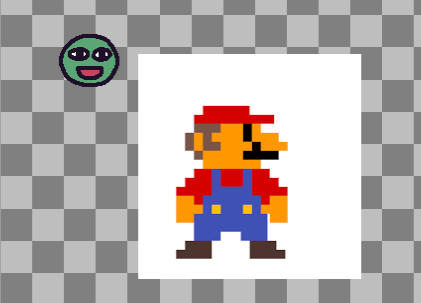
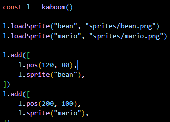
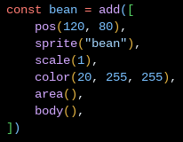
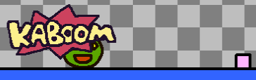
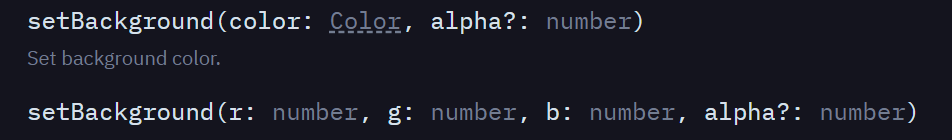
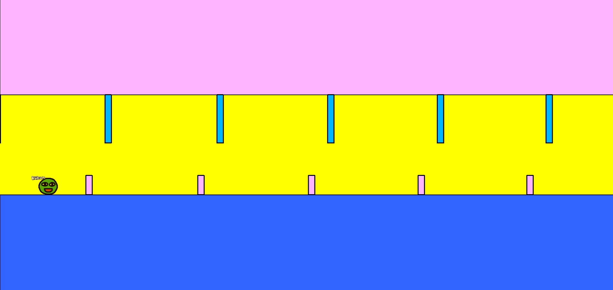
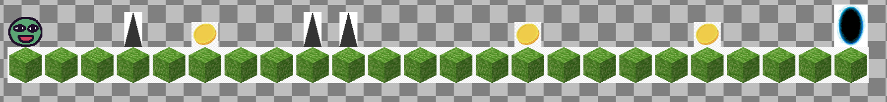
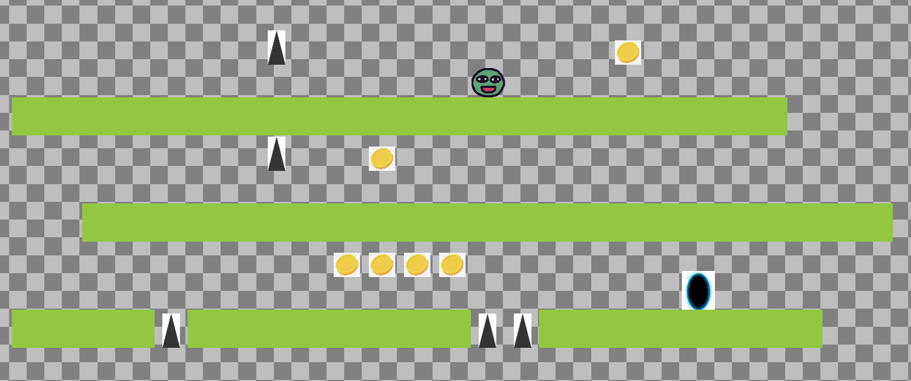
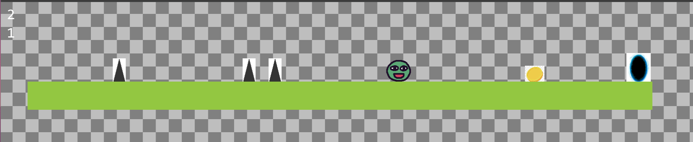

# Tool Learning Log

## Tool: **Kaboom.js**

## Project: **SEP FREEDOM Project**

---

### 9/30/24:
* Imported CDN for Kaboom.js
* [kaboom](https://kaboomjs.com/doc/setup)
* Changed the positioning of the text and the text itself

### 10/6/24:
* Added NPM for Kaboom.js
* Tried adding a sprite into the code and so I added Mario



* Also messed around with the code and changed the variables to see if it would change anything

* Learned that `npm run dev` would start a local server like http-sever would but for Kaboom.js
* Note, scale(any number) will change a sprites size
* Note, functions and vairables are very useful becuase of how repetitive some of the code gets

* `rect(width(), 70)` --> This command allows you make a rectangle and when you change the number within width, you can change the width, and the other number is to change the height
* `outline()` --> This makes an outline which is exactly the same as a border
* `pos(0, height() - 50)` --> This line of code allows the rectangle to sit on the bottom but subtracts from 0 to allow us to see it
* `area()` --> makes so that it can interact with other sprites
* `body({ isStatic: true })` --> This makes the rectangle unmoving and anything can't move past it as well
* `color(200, 150, 255)` --> This gives color to the rectangle

### 10/23/24 (for 10/28/24)
* By declaring the variable of the sprites name, then using the descriptions of the sprite, we are able to have the sprite be able to move and jump



* Having a bean that can just jump isn't enough so I looked at a tutorial that taught me how to implement obstacles onto the platform that kept moving and something you can jump over
* By using a loop conditonal I was able to loop an obstable multiple times in a row

```js
loop(1, () => {
    add([
        rect(20, 20),
        area(),
        outline(4),
        pos(width(), height() - 50),
        anchor("botleft"),
        color(255, 180, 255),
        move(LEFT, 400),
        "tree",
    ]);
});
```
* This code shows how I made a small rectangle with the rect code, specifying the height and width.
* Then I gave it area so it could interact with my sprites, the outline for a design look
* the pos specifies where it will be while the anchor keeps it there like an anchor
* move(LEFT,400) tells the obstacle where to move continiously, I specified Left and at a speed of 400 pixels per second
* And I learned about "name" so I can use that name to interact with other things in my world


``` js
bean.onCollide("block", () => {
    addKaboom(bean.pos);
    shake();
});
```


* This line of code allowed me to have a message "Kaboom" pop up when the bean collides with the obstacle I made while shaking the screen mildly
* I was able to change the size, length, width of the obstacle as well as its color
* I was also able to change the speed it was moving as well as the overall gravity of the entire "world"

### 11/5/24 (LL3)
* Trying to use what I learned so far, I tried impmenting obstacles on the roof to increase the challenge and make it more visually appealing by taking up the white space
* After repreatly trying, I couldn't get it to work, only after tinkering for a long time I got it to work
```js
 add([
    pos(0, 0),
    rect(2000, 300),
    outline(2),
    area(),
    color(255, 180, 255),
])
```
In this case, previously, I had thought that copying the previous code I had for the huge box would work and so I tried copy and pasting and moved the coordinates around
```js
add([
    rect(width(), 300),
    pos(0, height() - 300),
    outline(2),
    area(),
    body({ isStatic: true }),
    color(50, 100, 255),
])
```
* This to my suprise didn't work, it either brought me to an error screen or just would have nothing appear on my screen, this puzzled me and so I started doing a kind of rubber duck debugging and walked myself through each line of code and its function
* to my suprise, I actually figuered something out and it was that I had lots of unecessary code such as `pos(0, height() - 300),` and `pos(0, height() - 300)`, I would only need this if I was trying to erect a rectangle from the bottom to the top, and so I figuered that I can simply that by just simply stating where I wanted them to appear and the size of it towards the top.
* After a bit of tinkering, I eventually got it working which was nice
* Another feature I tried to add was a background color, I didn't like the png look of the background and tried to change it, through many different attempts and failures, I learned with each mistake
* I tried going on the official website which had all the code but it was put in a style that I couldn't understand


* I started out with `setBackground(r: number, g: number, b: number, alpha?: number)` and kept trying untill it would work. It actually got to a point where I kept removing the code on the inside and got left with `add([rect(2000, 300]), color(0,0,255)` though this didn't work as it erected a giant shape on top of the entire game, I combined the official documentation's code as well as my own thought process and ended up with `setBackground(255, 255, 0);` this to my excitement worked, it changed the png background and changed the color to my desired color.




### 11/18/24 (LL4)
* This time I want to try to make levels for a game instead of having a game run continiously so that the user can see variations
* Started by importing a new game file to work on called mygame2, to test things out and see what I can acomplish
* As I tried working to find a solution to start making a level, looking through the documentation, they all used Replit and that was something I wasn't using
* Therefore I tried looking back on what I had done previously in mygame while also looking through the documentation
* I Tried really hard to understand how to create a level but it never happened, but it will become a goal for me
* So i tried to do the little bits first, such as trying to allow the bean to even move left to write, the previous game was a infinite game where the obstacles kept coming at you and you only had to jump
* Moving left to right was more difficult than I thought, it wasn't as simple as it seemed and tried looking online for what the answer might be, though I only got fragments.
* I had this code on the previous game and after looking
```js
onKeyPress("w", () => {
    if (bean.isGrounded()) {
        bean.jump();
    }
});
```
* I found a snippet of code while looking at the documentation `bean.move(-SPEED, 0)`, though it seemed simple and unordinary, this changed what I thought I could do, I thought about utilizing that snippet with what I already had because I had set a floor the bean could land on but it wasn't moving
* And after numerous attempts in Frankensteining the code together, something clicked and it worked.
```JS
const SPEED = 400;

onKeyDown("a", () => {
	if (bean.isGrounded()) {
		bean.move(-SPEED, 0)
	}
})

onKeyDown("d", () => {
	if (bean.isGrounded()) {
		bean.move(SPEED, 0)
	}
})
```
* With the conditional of pressing down a button, (not on key press) I could use a conditional exactly the same as the game from mygame and instead of using the ssme inside code, I changed it to where it would depending on the button you held, move your direction in a certain way by attatching thr button with a change in speed.
* I made it so that only when the bean was on the floor, it could move left and right using the keyboard
* As I had more code than I used to, I noticed while looking through documentation how everything had a comment to them, noting down their purpose, clarifying the code which was all bunched up together, and I took inspiration and included that into my coding


### 12/7/24 (LL5)
* Continuing on what I had previously, I sought out to create scene, not level as level indicates singular while a scene is composed of multiple
* To get started, I looked at official documentation on how to get started with a scene and on [kaboomjs.com](kaboomjs.com) I scrolled down to the scene() and level() section to read what its components were and how to use them
* At a surface level, it looked easy, all I had to do was set up some code and then by substituiting characters or letters as my sprites, I was able to create a level.
* Using what I saw on the official website and an additional informational [video](https://www.youtube.com/watch?v=Dkxwe_Gv7q4) I was able to have a sense of an idea of how to get started making levels

```JS
const LEVELS = [
	[
		"@  ^ $  ^^    $    $   >",
		"========================",
	],
	[
		"@   $   $   $   $   >",
		"=   =   =   =   =   =",
	],
]
```

* And so I started out simple and tried to create a layout with 2 levels inside, being able to move from level 1 to level 2
* Though I loaded up my code, expecting to see the bean on my grass block with all my other sprites loaded in. But I saw none of that
* As I saw nothing, obviously something was wrong and so I checked back with my sources to see what I did differently from them.
* As I inspected, I saw how they redefined their sprites within a function called "scene"

```JS
scene("game", ({ levelIdx, score }) => {

	// Use the level previously defined
	const level = addLevel(LEVELS[levelIdx || 0], {
		tileWidth: 64,
		tileHeight: 64,
		pos: vec2(100, 200),
		tiles: {
			"@": () => [
				sprite("bean"),
				area(),
				body(),
				anchor("bot"),
				"bean",
			],
			"=": () => [
				sprite("grass"),
				area(),
				body({ isStatic: true }),
				anchor("bot"),
				scale(.18),
			],
			"$": () => [
				sprite("coin"),
				area(),
				anchor("bot"),
				scale(.3),
				"coin",
			],
			"^": () => [
				sprite("spike"),
				area(),
				anchor("bot"),
				scale(.2),
				"danger",
			],
			">": () => [
				sprite("portal"),
				area(),
				anchor("bot"),
				scale(.3),
				"portal",
			],
		},
	})
```
* As I looked at the documentation in the video and website I realised how they set each symbol equal to a sprite and thats where you make the connection. And so I did that myself, writing the code above
* The "Level" I created had "@" as my Bean sprite; "^" as my spike; "$" as my coins; and "=" as my grass blocks with quotation marks defining the border
* With this addition and `const bean = level.get("bean")[0]` as my tag for bean
* I was able to start my game up with
```JS
function start() {
	// Start with the "game" scene, with initial parameters
	go("game", {
		levelIdx: 0,
		score: 0,
	})
}

start()
```
* Initializing my game and giving it a basic look with nothing special yet

* For my next addition, I could try adding sounds, and connecting the portal to the second level


### 12/28/24 (LL6)
* During break my goal was to add sound effects for when my sprite interacted with the surrounding levels, such as when it collects a coin, falls to its death, enters a portal, or hitting a spike.
* An additional goal I had in mind for the break was to add additional levels that were unique and would be fun to play on.
* With those goals in mind, I started out by first researching with how I could implement sound effects into my levels, and so first place I checked was the official website for [kaboom](kaboomjs.com)
* I looked at the playground section as it shows diverse examples of different elements of kaboom being implemented as an example and so I stumbled upon the "audio" section, at first look it looked too complicated and after reading the code further, it was clear that it was something that I wasn't looking for, with nowhere to go, I decided to move onto adding additional levels
* There was a "scenes" section as well, looking at the example and the code, it became clear on how to add additional levels, but that wasn't the only reason I looked at the section, I remember when tinkering around and playing around in the section, there were sound effects when interacting with objects, which was exactly what I was looking for
* With my goal in sight, I found the code that acitvated the audio `play()`
* And at the top, there was something similar when loading in sprites with sounds.
* Noting the similarity, I went online to look for mp3 sounds that would pair up perfectly with my game, and after looking online, I found [zapsplat](https://www.zapsplat.com/sound-effect-categories/)
* So first things first, I used `loadSound()` which worked similarly to `loadSprite()` which made it easy to use, afterwards, in the collisions, I added `play()` and their respective sounds, and this process worked perfectly
* Afterwards, I wanted to add new levels, using what I saw previously and what I already had, I added variations into my levels, with huge changes in elevations and long levels where one path is predetermined



* I did this by manipulating the symbols each sprite represented to create a new unique level
```JS
const LEVELS = [
	[
		"@  ^ $  ^^    $    $   >",
		"========================",
	],
	[
		"@   $   $   $   $   >",
		"=   =   =   =   =   =",
	],
	[
		"  $               $   ",
		"  =     $         =   ",
		"   @    =      $      ",
		"   =        $  =      ",
		"     $      =      >  ",
		"     =             =  ",
	],
	[
		"       ^  $      $     ",
		" @                     ",
		"====================== ",
		"       ^  $            ",
		"                       ",
		"  =======================",
		"         $$$$          ",
		"                   >   ",
		"====^========^^========",

	],
]
```
* With this code containing all my levels, I also played around with floor and while doing so, realized that all the quotation marks didn't have to all be on one line, with kaboom giving lots of freedoms with how to create levels.


### 1/11/25 (LL7)
* As I set out for a new goal, I thought about making a new counter, a counter to keep track of what level the user was on
* The accumulated score would also appear at the end, congratulating the player on how many coins they collected and how many levels they passed
* As I had that goal in mind, I started to formulate a plan in my head, I would start by adding an additional counter under the exisisting coin counter

```JS
function start() {
	go("game", {
		levelIdx: 0,
		score: 0,
		score2: 1,
	});
}

const scoreStage = add([
		text(score2),
		pos(15, 60),
	])
```

* I then would add a score to my `scoreStage` every time the bean passed into a portal as that would signify the next level

```JS
bean.onCollide("portal", () => {
		play("portal")
		score2++;
		scoreStage.text = score2;
		if (levelIdx < LEVELS.length - 1) {
			go("game", {
				levelIdx: levelIdx + 1,
				score: score,
				score2: score2,
			})
		}
}
```
* This helped greatly as already by this stage, the counter was up and the number was there, though I had a problem with the number saying undefined each time
* This stumped me because as a thought, I added score2 counters wherever there was a score counter as they should co-exist perfectly, but that didn't work
* Having no other choices, I reached out to Joe as he is my freedom project partner and he is working on the same tool as him
* As I consulted with Joe about my problem, he suprisingly had the same problem as me and he eventually figured it out by asing other friends and using external resources
* He told me that the problem was that somewhere in my code, the computer was confused about the scores and it wasn't properly defined in a place when each scene started
* As he told me that valuable information, I started to look at places in my code where it said "go" and my score2 variable wasn't there
* I found that my `go("win", { score: score})` scene which manages the end screen is missing my score2 variable and coincidentally, the only place my score wasn't working and appearing was at the win scene
* As a fix, I tried `go("win", { score: score}, { score2: score 2})`, mimicking what I wrote for score 1, though it still didn't work
* As I tried tinkering around, Joe pointed out that maybe I should try joining the 2 different variables together, and so I tried his idea
* I tried `go("win", { score: score, score2: score2})` and it worked perfectly well, allowing my code to finally display the amount of coins grabbed and the levels the user passed




### 3/2/25 (LL8)
* Me and Joe have been working hard on a newly merged repository, working to merge our works together
* While our code worked perfectly fine, we realized that after we tried it on different devices, our levels didn't look as organized or even fit on different computer screens
* As we thought about solutions to this problem, we thought about using media querys but in the end, we thought that it would be too complicated
* As an alternative, we thought about utilizing different camera position that we saw while exploring [kaboom's](kaboomjs.com) documentation
* The first few attempts it didn't work as I didn't realized that the "player" tag had to change as the documentation only used "player" as a placeholder
* We found that if you added

```JS
	bean.onUpdate(() => {
		camPos(bean.worldPos()) // Set the viewport center to player.pos
	})

	bean.onPhysicsResolve(() => {
		camPos(bean.worldPos()) // Set the viewport center to player.pos
	})
```

* The onUpdate changes the camera position to be locked onto the bean
* The onPhysicsResolve locks the camera onto bean
* This discovery as a result solved our problem
* But this solution also brought a new problem, the score counter on the screen wasn't locked as a result, looking really odd
* To find the solution, I browsed the documentation some more and eventually found the `fixed()` component which keeps things in place
* I simply created a variable that would add the fixed value to whatever it was added to, when then I added onto my text code.

```JS
	const stationary = add([
		fixed(), //keeps anything its attatched to fixed
	])

	const scoreLabel = ui.add([ //attached
		text(score),
		pos(15),
	])
	const scoreStage = ui.add([
		text(score2),
		pos(15, 60),
	])
```
* This as a result solved my issues, with the camera following the player, the levels would all look the same, and the score counter was also now in a fixed position
* Next time I want to continue with my progress and understanding of kaboom by merging more of my code into the same repository as Joes in order to be on track for the freedom project


