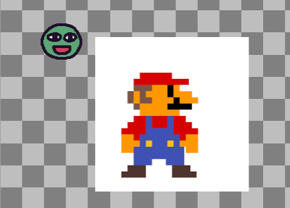
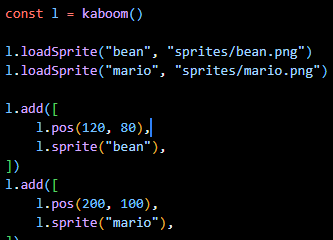
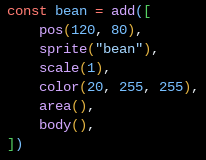
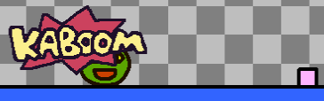
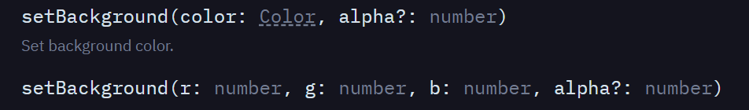
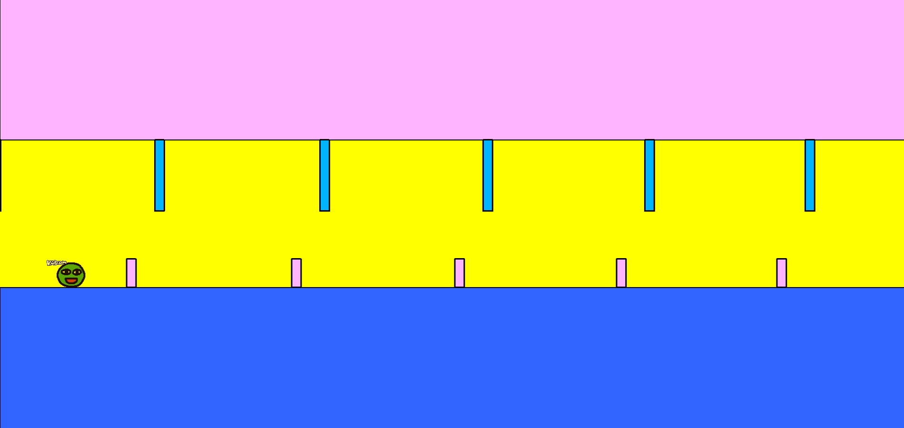

# Tool Learning Log

## Tool: **Kaboom.js**

## Project: **SEP FREEDOM Project**

---

### 9/30/24:
* Imported CDN for Kaboom.js
* [kaboom](https://kaboomjs.com/doc/setup)
* Changed the positioning of the text and the text itself

### 10/6/24:
* Added NPM for Kaboom.js
* Tried adding a sprite into the code and so I added Mario



* Also messed around with the code and changed the variables to see if it would change anything

* Learned that `npm run dev` would start a local server like http-sever would but for Kaboom.js
* Note, scale(any number) will change a sprites size
* Note, functions and vairables are very useful becuase of how repetitive some of the code gets

* `rect(width(), 70)` --> This command allows you make a rectangle and when you change the number within width, you can change the width, and the other number is to change the height
* `outline()` --> This makes an outline which is exactly the same as a border
* `pos(0, height() - 50)` --> This line of code allows the rectangle to sit on the bottom but subtracts from 0 to allow us to see it
* `area()` --> makes so that it can interact with other sprites
* `body({ isStatic: true })` --> This makes the rectangle unmoving and anything can't move past it as well
* `color(200, 150, 255)` --> This gives color to the rectangle

### 10/23/24 (for 10/28/24)
* By declaring the variable of the sprites name, then using the descriptions of the sprite, we are able to have the sprite be able to move and jump



* Having a bean that can just jump isn't enough so I looked at a tutorial that taught me how to implement obstacles onto the platform that kept moving and something you can jump over
* By using a loop conditonal I was able to loop an obstable multiple times in a row

```js
loop(1, () => {
    add([
        rect(20, 20),
        area(),
        outline(4),
        pos(width(), height() - 50),
        anchor("botleft"),
        color(255, 180, 255),
        move(LEFT, 400),
        "tree",
    ]);
});
```
* This code shows how I made a small rectangle with the rect code, specifying the height and width.
* Then I gave it area so it could interact with my sprites, the outline for a design look
* the pos specifies where it will be while the anchor keeps it there like an anchor
* move(LEFT,400) tells the obstacle where to move continiously, I specified Left and at a speed of 400 pixels per second
* And I learned about "name" so I can use that name to interact with other things in my world


``` js
bean.onCollide("block", () => {
    addKaboom(bean.pos);
    shake();
});
```


* This line of code allowed me to have a message "Kaboom" pop up when the bean collides with the obstacle I made while shaking the screen mildly
* I was able to change the size, length, width of the obstacle as well as its color
* I was also able to change the speed it was moving as well as the overall gravity of the entire "world"

### 11/3/24 (LL3)
* Trying to use what I learned so far, I tried impmenting obstacles on the roof to increase the challenge and make it more visually appealing by taking up the white space
* After repreatly trying, I couldn't get it to work, only after tinkering for a long time I got it to work
```js
 add([
    pos(0, 0),
    rect(2000, 300),
    outline(2),
    area(),
    color(255, 180, 255),
])
```
In this case, previously, I had thought that copying the previous code I had for the huge box would work and so I tried copy and pasting and moved the coordinates around
```js
add([
    rect(width(), 300),
    pos(0, height() - 300),
    outline(2),
    area(),
    body({ isStatic: true }),
    color(50, 100, 255),
])
```
* This to my suprise didn't work, it either brought me to an error screen or just would have nothing appear on my screen, this puzzled me and so I started doing a kind of rubber duck debugging and walked myself through each line of code and its function
* to my suprise, I actually figuered something out and it was that I had lots of unecessary code such as `pos(0, height() - 300),` and `pos(0, height() - 300)`, I would only need this if I was trying to erect a rectangle from the bottom to the top, and so I figuered that I can simply that by just simply stating where I wanted them to appear and the size of it towards the top.
* After a bit of tinkering, I eventually got it working which was nice
* Another feature I tried to add was a background color, I didn't like the png look of the background and tried to change it, through many different attempts and failures, I learned with each mistake
* I tried going on the official website which had all the code but it was put in a style that I couldn't understand


* I started out with `setBackground(r: number, g: number, b: number, alpha?: number)` and kept trying untill it would work. It actually got to a point where I kept removing the code on the inside and got left with `add([rect(2000, 300]), color(0,0,255)` though this didn't work as it erected a giant shape on top of the entire game, I combined the official documentation's code as well as my own thought process and ended up with `setBackground(255, 255, 0);` this to my excitement worked, it changed the png background and changed the color to my desired color.


<!--
* Links you used today (websites, videos, etc)
* Things you tried, progress you made, etc
* Challenges, a-ha moments, etc
* Questions you still have
* What you're going to try next
-->
